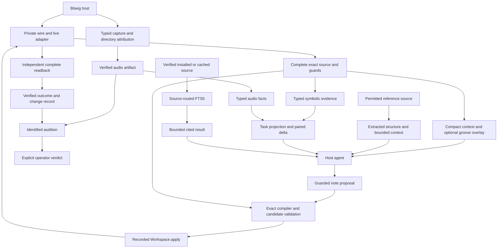

# Workstation seam map

Use the [contracts](WORKSTATION_CONTRACTS.md) and
[inventory IDs](WORKSTATION_INTERFACES.md) with this map. An existing component
fixture is not evidence that an unbuilt adapter works. Each new connection below
has a specific blocker and a successor session. No new provider is implemented
by this audit.

## Data flow

Computer use is a separate UI-observation/write path. Serialize its writes with
Ghostnote writes. Refresh exact source after an external change. Neither path
can relabel the other's evidence or acquire its ownership by association.

## Compatibility ledger

`Existing` means the listed component has a fixture. `Blocked` means the new
Phase 7 connection cannot run yet. A block in this table is a precise planned
implementation gate, not unfinished provider work in 6i.

| Seam | Producer → consumer; explicit adapter | Fixture or blocker; owner |
|---|---|---|
| S01 / I01–I03 | MCP request → workspace → typed adapter → wire; surface validator and live encoder | Existing: [surface tests](../../../brain/src/surface/surface.test.ts), [encoder tests](../../../brain/src/adapters/live/encoder.test.ts), [wire map tests](../../../brain/src/adapters/live/wiremap.test.ts). The [7b experimental profile tests](../../../brain/src/surface/experimental-musical-surface.test.ts) select the proposal union without changing the stable tool list or deterministic v1 input. |
| S02 / I03–I05 | Wire observation → Snapshot/receipt → recorded Take/stash; live decoder and `Workspace.apply` | Existing: [live adapter tests](../../../brain/src/adapters/live/adapter.test.ts), [executor tests](../../../brain/src/engine/executor.test.ts), [stash tests](../../../brain/src/stash/stash.test.ts). These tests do not establish new agent-source mapping or current live deployment compatibility. |
| S03 / I04,I09 | Complete read → exact-source wrapper; `snapshotToExactSource` | Implemented in 7a: [exact-source tests](../../../brain/src/musical/exact-note-source.test.ts) cover two clips, all 16 channels, optional expression/recurrence, non-ASCII metadata, reordered keys, fine triplet duration, incomplete channel, stale generation and address guards, duplicates and missing reads. [E120](../experiments/e120-symbolic-context-connects-complete-live-state.md) connects one complete live read. |
| S04 / I04,I10 | Exact source → strict v0 context plus metadata; `exactSourceToContext` | Implemented in 7a: [projection tests](../../../brain/src/musical/symbolic-context.test.ts) cover aliases, rational beats, mute mapping, omitted fields, authority, empty input, missing tempo, absent intent, supported measurements, bounded qualified and ambiguous harmony, and two-channel same-pitch notes. The [frozen context corpus](../../../brain/src/musical/agent-context.test.ts) is unchanged. |
| S05 / I09,I10 | Exact source → optional theory → qualified annotations; `symbolicEvidence` | Existing controlled provider input/output in [semantic tests](../../../brain/src/probes/phase6e-semantic-analysis.test.ts). Deferred because 7a did not enable theory. A named task must isolate Python startup, preserve source coverage, expose key alternatives and test its ambiguity rule. Missing Music21 already leaves exact context available. |
| S06 / I10,I11 | Context/source reference → agent proposal → complete candidate; `compileNoteProposal` | Implemented in 7b: [compiler tests](../../../brain/src/musical/note-compiler.test.ts) cover all four operations, literal stale and conflict refusals, complete unnamed fields, range, grid, collision, ambiguous channel, forbidden fields and pressure. [E121](../experiments/e121-guarded-agent-note-patches-pass-live-reference-dogfood.md) connects the real producer, compiler and live candidate. |
| S07 / I07,I11,I04,I05 | Complete candidate → typed operations → `Workspace.apply` → independent readback; `candidateToOps` | Implemented in 7b: [compiler tests](../../../brain/src/musical/note-compiler.test.ts) cover all-channel reconstruction, insert-only writes, fresh preflight, recorded apply, host defaults, independent complete readback, reversal data and partial-effect retention. E121 records one exact live write, readback, reversal and cleanup. |
| S08 / I12,I11 | Nominal/component proposal → realized note proposal; future `realizeGrooveProposal` | Blocked and excluded from initial 7b. E116 checks equality to four expected objects, not arbitrary lowering. A future task must add versioned operations, component preservation, target-channel/default policy, generator determinism and complete candidate fixtures. No silent acceptance of `ghostnote-groove-patch-v0`. |
| S09 / I13,I10,I11 | Reference source → extracted traits/optional raw context → candidate copy/trait report; `referenceProjection` and independent comparator | Implemented in 7b: [reference tests](../../../brain/src/musical/reference-context.test.ts) cover separate identities, permission, complete/used/excerpt coverage, changed hashes, exact copy and structural-only transfer. E121 uses extracted structure by default and compares the complete reference independently. |
| S10 / I09,I14 | Typed symbolic facts → paired sensory v1; `routeEvidence` | Existing E118 MIDI controls. Deferred because 7a did not select a paired MIDI comparison. A later named task must replace the probe provider name, select only task fields, remove note duplication, define formula/tolerance and emit both sources. |
| S11 / I15,I03 | Capture request → typed recorder operations → stable artifact; `captureMasterArtifact` | Existing E103 three-run evidence and [probe](../../../brain/src/probes/phase6a-master-recorder.ts). Blocked, 7e: `masterRecorder.*` is not in the product wire map. Add typed route, bounded lifecycle, known project-directory association, active-recorder refusal and header reader. Test zero/two files, reused path, file changing during hash, stop timeout and reconnect. A directory name or project title alone is not association proof. |
| S12 / I15,I16 | Capture or supplied file → audio provider; `verifyAudioArtifact` | Supplied-file input is implemented in 7d. [Audio tests](../../../brain/src/audio/audio-facts.test.ts) verify stable bytes, permission, format, range, channels, mutation and missing executables. [E124](../experiments/e124-audio-facts-and-sensory-packets-connect-verified-files.md) connects verified E118 files and one nonzero single-channel range without Bitwig. The capture producer remains 7e work. |
| S13 / I16,I14 | Audio facts → paired sensory v1; same `routeEvidence` contract as S10 | Implemented for audio in 7d: versioned formulas, full field metadata and pure task routing. Fixtures cover silence/nulls, no-change, level control at 0.2 LU, frame/channel incompatibility, missing fields, source inconsistency and undefined presence. E124 reproduces brightness, loudness, crest and silence controls. |
| S14 / I17,I18 | Verified cache/installed source → corpus/index → cited result; `verifiedSourceToDocument` | Implemented in 7c: [provider tests](../../../brain/src/documentation/documentation-provider.test.ts) and [cache tests](../../../brain/src/probes/phase6b-document-cache-lib.test.ts) cover checked-byte extraction, family routing, exact compatibility, cited hits, stale indexes, corrupt caches, no match, unavailable sources and missing PDF extraction. [E122](../experiments/e122-documentation-provider-connects-verified-offline-sources.md) connects the installed API to one offline task. [E123](../experiments/e123-automatic-user-guide-cache-is-cold-to-warm.md) adds one keyed, deadline-bound, size-bound guide download on a missing cache entry and proves offline warm reuse. |
| S15 / I19–I22 | Native catalog/donor/seed/file → composition planner → existing guarded workspace | Existing [catalog tests](../../../brain/src/native-catalog/catalog.test.ts), [bwmod tests](../../../brain/src/bwmod/bwmod.test.ts), [composition tests](../../../brain/src/composition/template-composer.test.ts), [late-bound tests](../../../brain/src/composition/late-bound-assets.test.ts). Retain existing internal adapters. A new module-to-module preset export is blocked on byte digest and provenance wrapper; 7f must add it only if the selected task uses that seam. Vendor-preset loading remains outside this route. |
| S16 / I05,I06,I08,I23,I24 | Changes/status, evidence, UI events, audition and operator response → run record | Existing [observation record](../../../brain/src/observation/record.test.ts), [store tests](../../../brain/src/observation/store.test.ts), [operation tests](../../../brain/src/surface/operations.test.ts). Blocked, 7f: cross-module record must link profile, request/source/artifact/change IDs, timings, UI changes and final baseline. Explicit operator response only; model response and blind key cannot supply it. |
| S17 / I24 and all new modules | Configured descriptor → isolated startup → correlated request/result | The 7a registry and 7c documentation boundary remain. The 7d audio module adds preflight before executable discovery, linked startup cancellation, separate FFprobe/FFmpeg availability, process-output limits and correlated results. A cancelled startup remains retryable. Provider timeouts stay distinct and do not disable another module. Later workers still own their framing and cache fixtures. |

## Field translations that must be tested

| Source field | Destination | Required rule |
|---|---|---|
| `Snapshot.at` and guarded addresses | Exact-source wrapper and compiler preflight | Copy the actual mark/address objects. Keep generation, coverage and project uncertainty. Never derive a target from its display name. |
| Address MIDI channel + `NoteRecord` key | Opaque context event ID | Store a reversible source-scoped map. Channel omission in compact text does not discard it from exact state. |
| `startBeats`, `durationBeats`, `isMuted` | Context `atBeats`, `durationBeats`, `mute`; proposal `start`, `duration` | Explicit rational/name conversion. Preserve host-normalized durations separately from requested grid values. |
| Context `source.sha256` | Proposal `base_sha256` | Same exact-source digest domain. Context-render fingerprint is a separate hash. |
| E116 probe groove JSON | I10 linked groove overlay | Re-key by existing event IDs; preserve generator/settings and validate realized-time equations. No direct cast between schemas. |
| E114 probe `release_velocity`/`expression` | `NoteRecord` properties | Rename and scale explicitly; retain all additional host fields absent from probe records. Refuse unsupported writes. |
| E118 `source_identity`, `coverage`, `uncertainty_rule` | Shared source/coverage and typed metric limits | Preserve both pair members. Replace probe provider identity with the actual adapter and formula version. |
| E105 prose sample coverage ending at `N-1` | Structured `[0,N)` sample coverage | Convert inclusive final index to exclusive end. Preserve channels, frame tails and estimator coverage. |
| Byte hash, tree fingerprint, method hash, probe hash | Named shared digest domain | Preserve algorithm/domain/canonicalizer. Strip a `sha256:` display prefix only through an explicit parser; do not truncate or reinterpret. |
| Cached document vs installed tree | Retrieval source reference | Preserve product version, document version, compatibility, path/page/key and content/tree hash. Rank is not source authority. |
| Compiled expected state | Verified outcome | Compare with an independent complete host read. Keep expected state, observed state and discrepancies separate. |

## Verification-cost audit

The [6j cost ledger](WORKSTATION_VERIFICATION.md) accounts for validation,
canonicalization, hashing, projection and translation at S01–S17. It separates
provider compute, target acquisition, settlement, readback and reversal.
Unbuilt connection costs remain unknown. Component tests prove behavior, not
runtime bounds or complete consumer compatibility.

[E119](../experiments/e119-offline-verification-cost-audit.md) measures existing
context functions and corrects the current page-count reading: 32 beats need
20 pages with the selected 2,048-step reader, or 80 with a 512-step reader.
Use the advertised width. The [successor briefs](../../plan/phase-7/VERIFICATION_REDUCTIONS.md)
state equivalent evidence before any repeated validation or read can be removed.

## Phase 7 run gate

Each module brief must close its named blockers with real producer output that
the consumer accepts. Freeze success, refusal, stale-source and missing-provider
fixtures with the schema profile. Record any defaults and loss. Local component
checks are sufficient for a pure seam; live guards and readback need their own
bounded proof. Phase 7f repeats this check for the actual composed path.

The run record contains root session, client/model, mode, permissions, enabled
module and tool-profile versions, host/API/extension versions, exact baseline,
source/reference provenance, writes and change IDs, external UI actions, artifacts,
evidence authority, elapsed times, operator verdict, cleanup and exact exit state.
If a needed seam is still blocked, stop that path and record the boundary. Do not
substitute a probe import, UI assertion, or agent interpretation for conformance.
